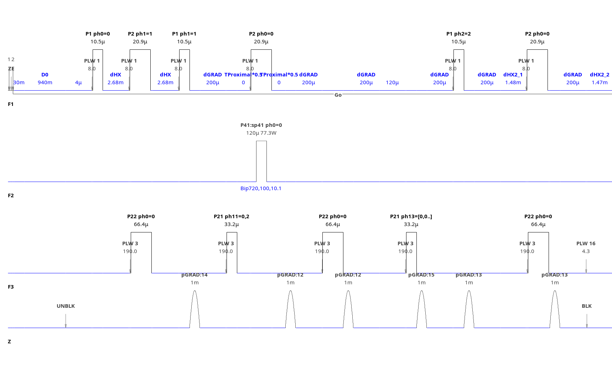
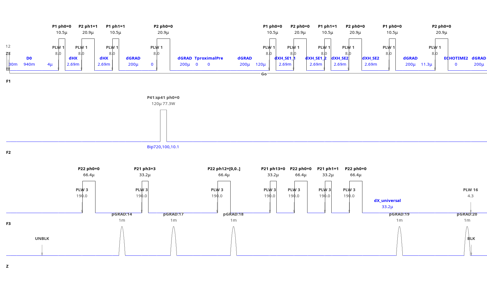
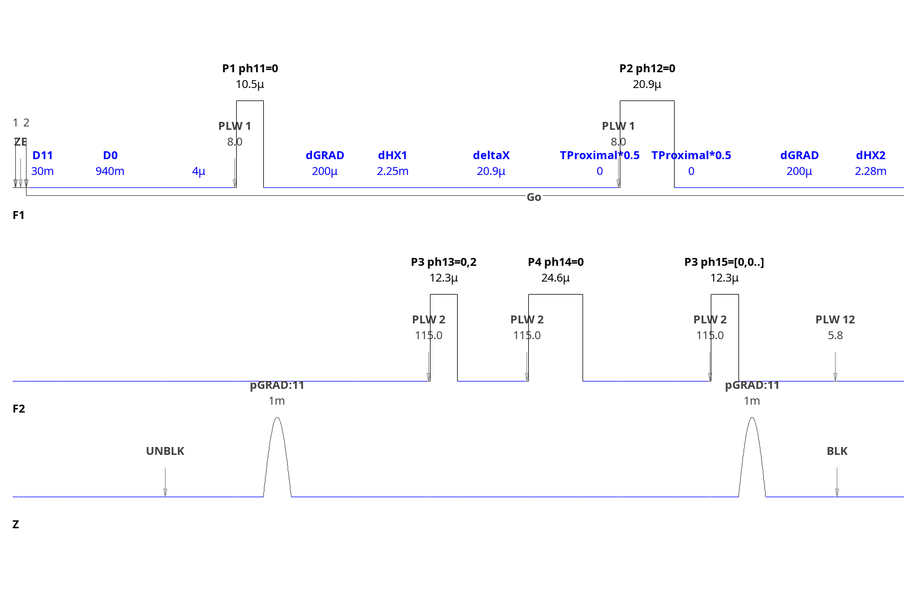
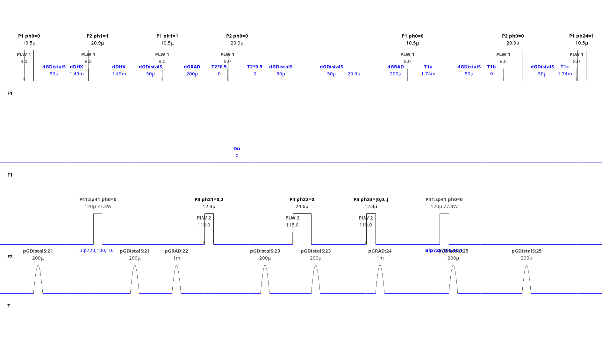
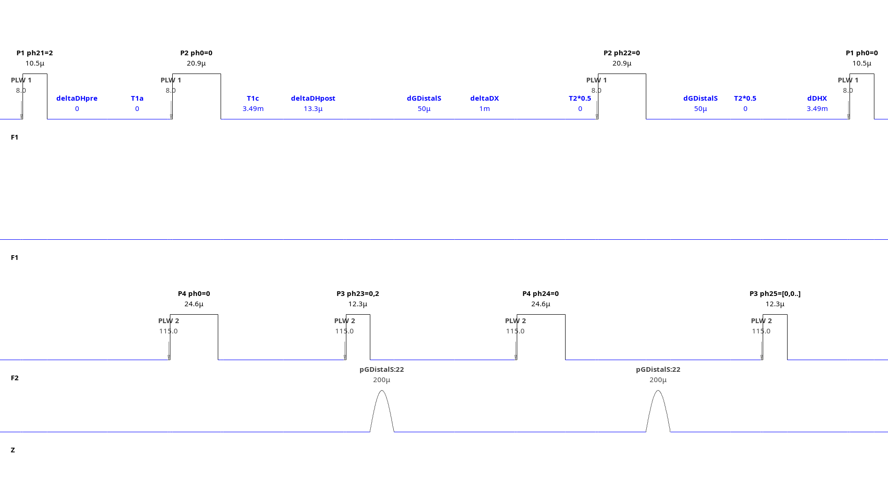

# Modular elements NMR library <!-- omit in toc -->

Modular Elements (ME) is a framework library for the development of pulse sequences for Bruker spectrometers. It provides two levels of abstraction, with the lower one comprising basic functional elements of pulse sequences and the higher one organizing the general flow of a pulse program and providing common building blocks for coherence transfers.

## Table of contents <!-- omit in toc -->

- [Adding the library to TopSpin](#adding-the-library-to-topspin)
- [Structure of the library](#structure-of-the-library)
  - [Low-level functionality](#low-level-functionality)
    - [Variables](#variables)
    - [Pulses](#pulses)
    - [Code blocks](#code-blocks)
  - [High-level functionality](#high-level-functionality)
    - [Structure of a ME pulse program](#structure-of-a-me-pulse-program)
    - [Auxiliary modules](#auxiliary-modules)
      - [*config.incl*](#configincl)
      - [*proximal\_2D.incl* and *distal\_2D.incl*](#proximal_2dincl-and-distal_2dincl)
    - [General modules](#general-modules)
      - [*init.incl*](#initincl)
      - [*start.incl*](#startincl)
      - [*end.incl*](#endincl)
    - [*phasecycles.incl*](#phasecyclesincl)
- [Specific modules](#specific-modules)
  - [Proximal modules](#proximal-modules)
    - [*hsqc.pp*: HSQC](#hsqcpp-hsqc)
    - [*hsqc\_se.pp*: HSQC SE or TROSY](#hsqc_sepp-hsqc-se-or-trosy)
    - [*hmqc.pp*: HMQC](#hmqcpp-hmqc)
    - [XH.pp](#xhpp)
  - [Distal modules](#distal-modules)
    - [*distal\_hsqc.pp*: distal HSQC for NOESY](#distal_hsqcpp-distal-hsqc-for-noesy)
    - [*distal\_hmqc.pp*: distal HMQC for NOESY](#distal_hmqcpp-distal-hmqc-for-noesy)
    - [HX.pp](#hxpp)
- [Pulse programs included in the library](#pulse-programs-included-in-the-library)
  - [Protein backbone assignment](#protein-backbone-assignment)
  - [4D NOESY](#4d-noesy)
- [Notes on TopSpin (for version 3.6.5)](#notes-on-topspin-for-version-365)
  - [Defined/named variables](#definednamed-variables)
  - [Macro expansion in relations](#macro-expansion-in-relations)

## Adding the library to TopSpin

Execute the `edpul` command and select ***Manage Source Directories*** from the ***Options*** submenu, as below.


To the ***Pulse Programs*** section add the directory containing the **ME** folder and the subdirectories containing pulse programs: **ME/seq/backbone**, **ME/seq/NOESY** and **ME/seq/2D**.

To the **prosol relation files** section (second to last) add the **/ME/prosol/** subdirectory. TopSpin needs to be restarted for the changes to take effect.


If you want to use the (experimental) auxiliary Python scripts to the ***Python Programs*** section add the **ME/py** subdirectory.

If the **ME** folder was copied over to a folder already used in the standard installation (like **../exp/stan/nmr/lists/pp/user**) step 1) above can be omitted.

## Structure of the library

### Low-level functionality

#### Variables

With no user-adjustable named variables available in TopSpin, we use indirection through a named variables (`define pulse NamedPulse`) and conventions attaching constant meaning to the numbered variables (such as `p16`). Variable mapping is done in *config.incl* (see below) and files named like the variable types, such as *delays.incl*, *pulse.incl*, ..., contained in the **ME/includes** subfolder. Default values for numbered variables can by set using the **me.set_parameters.py** TopSpin program. For variables that don't ordinarily have calculations performed on them (pulse phases `phN`, gradient programs `gpN`) we implemented full indirection, where the user can use `phFree1` or `phFree3` without worrying as to which `phN` variables are used by other parts of a pulse program.

#### Pulses

Pulses are implemented using function-like macros of ***cpp*** and have the general form of `nucleus_type(phase)`, where nucleus can be a general specifier like H/C/N or more specific like HN/HC/CA/CO and type is classified based on the desired functionality, with the main ones being: excitation (for the excitation of longitudinal magnetization), flipback (acting on transverse magnetization), refocussing, inversion (inverting longitudinal magnetization), `excitation_UR` and `flipback_UR` (implementing universal rotations). The pulse macros will have different replacement text based on global settings (usually ZGOPTNS). A proton pulse `H_excitation(ph)` will be replace by a hard pulse `p1 ph pl1` by default, but with a `-DH_SHAPED` option will instead evaluate tobe replaced by `p54:sp54 ph` for a selective soft pulse and the associated named variable `pH_excitation` will be set to have the same value as `p1` or `p54`.

Linear phase slope is compensated for using variables such as `eH_excitation`, which are set to the length of a delay giving equivalent coherence evolution time as the corresponding pulse (here `H_exctiation`). We assume that the flipback and flipback_UR pulses act as if they were time-reversed excitation pulses and so the effective evolution time for a flipback pulse acting on transverse magnetization is also `eH_excitation`. A `H_excitation_UR` pulse of phase x will give an effective time of `eH_excitation` for z magnetization, `eH_flipback` for y magnetization and `eH_excitation + eH_flipback` for x magnetization. By compensating delays using those variables the whole sequence can be switched from a hard pulse implementation to a shaped pulse version.

#### Code blocks

To limit the number of conditional statements in the main pulse program, many are defined as macros that will expand to pulse program code based on options, for example `H2O_FLIPBACK(ph2)` will be replaced to by `(11:sp1 ph2):f1` in a pulse sequence with water flipback and by whitespace if using selective pulses. Similarly `DECOUPLE_H_ON` and `DECOUPLE_H_OFF` macros will turn on proton decoupling in a standard HNCO experiment but will have no effect in TROSY-HNCO.

### High-level functionality

#### Structure of a ME pulse program

The core element of the ME library are the 4 general modules ***init.incl***, ***start.incl***, ***end.incl*** and ***phasecycles.incl***. They are inserted into the general structure of pulse program as follows:

1) Configuration and compile-time calculations
- custom configuration and compile-time calculations
- ***init.incl***
- custom configuration and compile-time calculations continued
2) a `zd` or `ze` statement
3) Real-time calculations
- custom real-time calculations
- ***start.incl***
- pulse program body (pulses and delays) and real-time calculations
- ***end.incl***
4) Signal acquisition block (subsumed into ***end.incl***)
5) loop statements for scans of a FID and points of a multidimensional experiment (partly subsumed into ***end.incl***)
6) `exit` statement
7) Phasecycles and comments
- ***phasecycles.incl***
- phase program definitions
- variable comments

#### Auxiliary modules

##### *config.incl*

Sets basic utility macros, such as channels designations (`fN`, ...) or decoupling statements for acquisition (`CPD_POW`, `CPD_ON`, `CPD_OFF`) and process user-defined *ZGOPTNS* options, defining dependant macros as needed. Includes files defining macros for various variables, such as *pulses.incl*, *delays.incl* and *phases.incl*.

Sample labelling defines are used for automatic setting of decoupled nuclei and follow TopSpin standard library convention, with the options being:  `-DLABEL_C`, `-DLABEL_N` and `-DLABEL_D`. For convenience composite defines `-DLABEL_CND` or `-DLABEL_CN` can be used and will be converted to individual defines.

The proximal/distal heteronucleus (the X nucleus) is assumed to be N, unless overridden by `-DPROXIMAL_C` or `-DDISTAL_C`.

`-DTROSY` is used to set up TROSY experiments: turns off H decoupling and selects a TROSY variant for the proximal module.

`-DSHAPED` switches H pulses to shaped pulse, pulse parameters have to be set by the user according to variable descriptors.
Decoupling during acquisition is automatically used for the proximal X nucleus, but can be manually enabled by `-DCPD_N`/`DCPD_C` or turned off by `-DNO_CPD_N`/`-DNO_CPD_C`.

`-DRDGRAD` is used to turn on suppression of radiation dampening by gradients in modules that explicitly support this option.


##### *proximal_2D.incl* and *distal_2D.incl*

The *proximal_2D.incl* and *distal_2D.incl* files serve two functions. When included for the first time they define variables and macros used in the specific modules. This includes setting sets of pulses (*HX_* for proximal and *HDX_* for distal modules) and coherence evolution times *timeHX* and *timeHDX*. On each inclusion they include a specific proximal/distal module chosen based on defined macros. This centralizes the programming logic for that choice in a single place, instead of spreading it over the separate general modules.

#### General modules

##### *init.incl*

Initializes the library by including *config.incl* and includes the *proximal_2D.incl* and *distal_2D.incl* files for the first time. This sets up variables and macros used in subsequent inclusions of those files.

##### *start.incl*

First (by including *preparation.incl*) executes the relaxation delay with options for:

- `-DPRESAT`: solvent presaturation
- `-DTROSY_INV`: inversion of N magnetization before ralaxation delay in BEST-TROSY experiments
- `-DPURGE`: purging solvent magnetization using selected pulses and gradients
- `-DCRUSH`: crush C and N (depending on TROSY and labelling) magnetization after relaxation delay

It than imports *proximal_2D.incl* and *distal_2D.incl* for the second time. In typical applications distal module will execute its coherence transfer here.

##### *end.incl*

Includes the *proximal_2D.incl* and *distal_2D.incl* files for the third time with the proximal module usually executing coherence transfers.
Executes acquisition by including the *acq.incl* file with options for:

- `-DACQ_BIRD_C`: homodecoupling using a BIRD C(r, X) element
- `-DACQ_BASHD`: homodecoupling using pairs of refocussing pulses - one broadband and one selective for the active nuclei
- `-DACQ_C`: decoupling of weak couplings to C using inversion pulses
- `-DACQ_GRAD`: adds gradients flanking each (homo)decoupling element from the options above

Executes the `mc` statement setting up loops for multidimensional experiments and includes the MC statements provided by the proximal and distal module.

#### *phasecycles.incl*

Includes the *proximal_2D.incl* and *distal_2D.incl* files for the fourth time thus including their phase cycles and variable descriptions.

## Specific modules

### Proximal modules

#### *hsqc.pp*: HSQC

A 2D module comprising two INEPT blocks flanking a X nucleus evolution element.
`timeHX` needs to be set to time for H-X J coupling evolution.
Options:

- `-DGRAD`: use pairs of gradients in the two INEPT blocks and individual gradients after the INEPT and X evolution periods
- `-DPROXIMAL_GS`: use selection gradients in the X evolution and second INEPT elements
- `-DPROXIMAL_GRAD_SHORT`: use a pair of short gradients flanking the H and Y inversion pulses during X chemical shift evolution when not using gradient selection
- `-DFB`: use solvent-selective pulses to ensure that solvent magnetization is flipped back to +z at the end

#### *hsqc_se.pp*: HSQC SE or TROSY


A 2D module implementing:

`-DPROXIMAL_HSQC` a sensitivity-enhanced (also called coherence-order-selective) HSQC.

or

`-DPROXIMAL_TROSY`: a sensitivity-enhanced TROSY.
Both variants comprise an INEPT block followed by a X evolution period, followed by a pulse train implementing the desired sensitivity-enhanced transfer. `timeHX` is the time for the evolution of H-X coupling with H nucleus active and `timeXH` for the evolution of H-X coupling with X nucleus active.

For TROSY the default spin state selection is N$_\beta$ and H$_\beta$, but it can be adjusted by setting `-DX_ALPHA` or `-DALPHA`.
Options:

- `-DPROXIMAL_GRAD_SHORT`: use a pair of short gradients in the INEPT block and in each of the two echos of the sensitivity-enhanced pulse train
- `-DFB`: use solvent-selective pulses to ensure that solvent magnetization is flipped back to +z at the end

#### *hmqc.pp*: HMQC


A 2D module with two periods of H-X J coupling evolution flanking a multiple-quantum HX echo.
`timeHX` needs to be set to time for H-X J coupling evolution.
Options:

- `-DGRAD`: use a pair of gradients in the two H-X J coupling evolution periods (one gradient per period)
- `-DPROXIMAL_GRAD_SHORT`: use a pair of short gradients flanking the H and Y inversion pulses during X chemical shift evolution
- `-DFB`: use solvent-selective pulses to ensure that solvent magnetization is flipped back to +z at the end

#### XH.pp

A module implementing the last two evolution periods (X and H) of a protein triple resonance experiment. The first evolution period is a standard INEPT block and `timeHX` needs to be set to time for H-X J coupling evolution. The second period evolves the HX coupling (unless `-DTROSY` is used) and the XY coupling, while suppressing the evolution of the XA coupling, with Y and A nuclei chosen using the options below. By default uses semi-constant time evolution in the N dimension or constant-time evolution with staggered pulses.
Options (usually hard coded in the pulse program and not using ZGOPTNS):

- `-DPROXIMAL_A_CO`: decouple CO from X using an inversion pulse
- `-DPROXIMAL_A_CA`: decouple CA from X using an inversion pulse
- `-DPROXIMAL_Y_CO`: evolve NCO coupling using `timeNCO`
- `-DPROXIMAL_Y_CA`: evolve the NCA coupling using `timeNCA`
- `-DDISTAL_X_CT`: use constant-time evolution in the X dimension, with centered H and X pulses.
  
### Distal modules

#### *distal_hsqc.pp*: distal HSQC for NOESY


A 2D module comprising two INEPT blocks flanking a X nucleus evolution element.
`timeDHX` needs to be set to time for H-X J coupling evolution.
Options:

- `-DGRAD`: use individual gradients after the first INEPT and X evolution period
- `-DPROXIMAL_GRAD_SHORT`: use pairs of short gradients flanking the H and Y inversion pulses during X chemical shift evolution and in each of the INEPT blocks
- `-DFB`: use solvent-selective pulses to ensure that solvent magnetization is flipped back to +z at the end
- `-DHSHIFT`: use TPPI to shift the center of the indirect H dimension to `cnst61`

#### *distal_hmqc.pp*: distal HMQC for NOESY


A 2D module with two periods of H-X J coupling evolution flanking a multiple-quantum HX echo.
`timeDHX` needs to be set to time for H-X J coupling evolution.
Options:

- `-DDISTAL_GRAD_SHORT`: use a pair of short gradients flanking the H and Y inversion pulses during X chemical shift evolution
- `-DFB`: use solvent-selective pulses to ensure that solvent magnetization is flipped back to +z at the end
- `-DHSHIFT`: use TPPI to shift the center of the indirect H dimension to `cnst61`

#### HX.pp

A module implementing the first two evolution periods (H and X) of a protein triple resonance experiment. By default no chemical shift evolution is performed, as in the case of out-and-back experiments (HNCO, HNCACO,...). For straight-through experiments (like HNCANH) the distal H dimension can be evolved and turned into the first indirect dimension with `-DDISTAL_H_EVOLVED` and the distal X dimension with `-DDISTAL_X_EVOLVED`. The first evolution period is a standard INEPT block and `timeDHX` needs to be set to time for H-X J coupling evolution. The second period evolves the HX coupling (unless `-DTROSY` is used) and the XY coupling, while suppressing the evolution of the XA coupling, with Y and A nuclei chosen using the options below.
By default uses semi-constant time evolution in the H and X dimensions or constant-time evolution with staggered pulses.
Options (usually hard coded in the pulse program and not using ZGOPTNS):

- `-DDISTAL_A_CO`: decouple CO from X using an inversion pulse
- `-DDISTAL_A_CA`: decouple CA from X using an inversion pulse
- `-DDISTAL_Y_CO`: evolve NCO coupling using `timeNCO`
- `-DDISTAL_Y_CA`: evolve the NCA coupling using `timeNCA`

If the H or X dimension is evolved the following options can be used:

- `-DDISTAL_H_CT`: use constant-time evolution in the H dimension, with centered H and X pulses.
- `-DDISTAL_X_CT`: use constant-time evolution in the X dimension, with centered H and X pulses.
- `-DHSHIFT`: use TPPI to shift the center of the indirect H dimension to `cnst61`
  
## Pulse programs included in the library

### Protein backbone assignment

To illustrate the usefulness of the library we provide a set of standard 3D and 4D triple-resonance experiments:

- HNCA (*hnca.me.pp*)
- HNCO (*hnco.me.pp*)
- HNCACO (*hncaco.me.pp*)
- HNCOCA (*hncoca.me.pp*)

All the pulse programs can be customized by omiting H decoupling with `-DLABEL_D`, turned into TROSY variants with `-DTROSY` and for small proteins homodecoupling can be added with `-DACQ_BIRD_C`

### 4D NOESY

The *4D_NOESY.me.pp* pulse program implements a 4D NOESY experiment. `d10` is the NOE mixing time. The distal and proximal modules are chosen using options:

- `-DPROXIMAL_HSQC`: use the proximal HSQC module
- `-DPROXIMAL_HMQC`: use the proximal HSQC module
- `-DPROXIMAL_HSQC_SE`: use the proximal sensitivity-enhanced HSQC module
- `-DDISTAL_HSQC`: use the distal HSQC module
- `-DDISTAL_HMQC`: use the distal HMQC module
  
## Notes on TopSpin (for version 3.6.5)

### Defined/named variables

These are the limitations for named variables of the type `define pulse pExample`

Maximum label/name length is 15 characters.

Maximum number of operands in a relations like `"x = y1 + y2 + ..."` is 8.

Maximum number of defined pulses is 166.

Maximum number of defined delays is 128; MC uses 2 delays and 1 more per 
incremented variable.

Maximum number of defined loopcounters is 138; MC uses 3 per incremented variable.

### Macro expansion in relations

Preprocessor macro definitions do not work in quoted strings, but do work in comments.

To allow macro expansion in relations push first quotation mark up (DOES NOT WORK IN REAL TIME/AFTER `ze`!):
```
"
 p1 = 2u"
```
Relations with conditional statements use `{}` braces and if closed are invalid outside a single line relation, due to a buggy syntax check. Workaround is possible by putting them on separate lines.
```
"
 if (p1 > 1u) {p2 = 3u;
 } else {p2 = 4u;
 }"
``` 